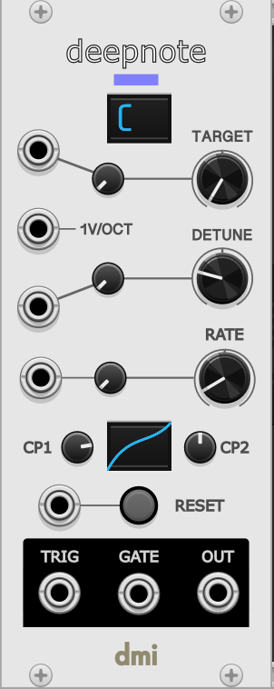

# deepnote-rack

A [deepnote](https://github.com/davidirvine/deepnote) voice packaged as a [VCV Rack](https://vcvrack.com) module. 

---

    

`DETUNE` sets the width of the frequency spread across all detuned sub voices. A CV input with attenuator trimpot can be used to modulate the DETUNE parameter.

`TARGET` defines the root note of the chord the voice is targeting. It can be modulated via CV input with an attenuator trimpot. The current root note is shown in the small LCD display.

`1V/OCT` input can be used for setting the root note.

`RATE` influences the rate with which the sub voices traverse from their start to target pitch. This parameter can be modulated via CV input and attenuator trimpot.

`CP1` and `CP2` help shape how a sub voice alters pitch over time providing easing and acceleration effects. The curve is illustrated in the LCD display. The horizointal axis is time increasing from left to right. The vertical axis is pitch from start to target, bottom to top.

`RESET` is a momentary button which sets start frequency to a random frequency and restarts pitch animation for each sub-voice. Reset can also be via the trigger input.

`TRIG` this trigger output fires when one or more sub-voices are at target pitch.

`GATE` this gate is held high when all sub-voices are at targget pitch.

`OUT` oscillator output

# Building

I have only built this plugin using the VCV Rack Plugin SDK on my Apple Silicon MacBook. I con't think of anything that would make building on any other platform an issue. See the VCV Rack [Plugin Development Tutorial](https://vcvrack.com/manual/PluginDevelopmentTutorial) for instructions on how to get set up.

With the `RACK_DIR` environment variable pointing to your Rack-DSK install simply run `make`. To install into Rack run `make install`. Restart VCV Rack and the module should be available. 
